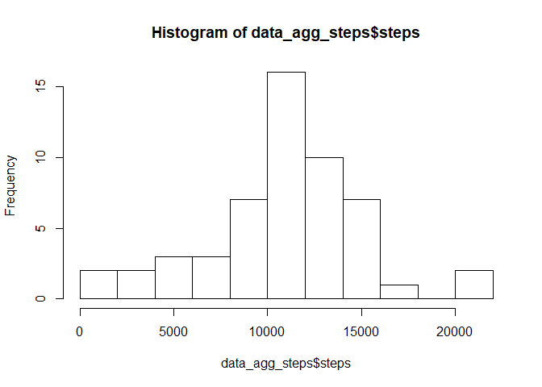

## Loading and preprocessing the data

```r
data <- read.csv('activity.csv')
head(data)
```

```
##   steps       date interval
## 1    NA 2012-10-01        0
## 2    NA 2012-10-01        5
## 3    NA 2012-10-01       10
## 4    NA 2012-10-01       15
## 5    NA 2012-10-01       20
## 6    NA 2012-10-01       25
```

## What is mean total number of steps taken per day?

```r
data_agg_steps <- aggregate(steps ~ date, data, sum)
head(data_agg_steps)
```

```
##         date steps
## 1 2012-10-02   126
## 2 2012-10-03 11352
## 3 2012-10-04 12116
## 4 2012-10-05 13294
## 5 2012-10-06 15420
## 6 2012-10-07 11015
```

```r
histo <- hist(data_agg_steps$steps, breaks = 10)
```

<!-- -->

```r
meansteps <- mean(data_agg_steps$steps)
mediansteps <- median(data_agg_steps$steps)
print(paste(meansteps, mediansteps))
```

```
## [1] "10766.1886792453 10765"
```

The mean number of steps taken per day is 10766.19. The median number of steps taken per day is 10765.

## What is the average daily activity pattern?

```r
data_agg_interval <- aggregate(steps ~ interval, data, mean)
plotline <- plot(data_agg_interval, type='l')
```

<!-- -->

```r
maxsteps_interval <- data_agg_interval[which(data_agg_interval$steps == max(data_agg_interval$steps)), 1]
print(maxsteps_interval)
```

```
## [1] 835
```
The 5-minute interval labeled 835 on average has the maximum number of steps.

## Inputing missing values

```r
num_na <- sum(is.na(data))
print(num_na)
```

```
## [1] 2304
```
The number of missing values is 2304. Filling missing values with the average for that interval. 

```r
for (ii in 1:length(data_agg_interval[[1]])) {
     data[(is.na(data)) & (data$interval ==  data_agg_interval$interval[[ii]]),]$steps <- data_agg_interval$steps[[ii]]
}
head(data)
```

```
##       steps       date interval
## 1 1.7169811 2012-10-01        0
## 2 0.3396226 2012-10-01        5
## 3 0.1320755 2012-10-01       10
## 4 0.1509434 2012-10-01       15
## 5 0.0754717 2012-10-01       20
## 6 2.0943396 2012-10-01       25
```

```r
data_agg_steps_fill <- aggregate(steps ~ date, data, sum)
histo_fill <- hist(data_agg_steps_fill$steps, breaks=10)
```

<!-- -->

```r
meansteps_fill <- mean(data_agg_steps_fill$steps)
mediansteps_fill <- median(data_agg_steps_fill$steps)
print(paste(meansteps_fill, mediansteps_fill))
```

```
## [1] "10766.1886792453 10766.1886792453"
```

The mean number of steps taken per day from filled in data is 10766.19. The median number of steps taken per day from filled in data is 10766.19. 

The mean remains the same from earlier but the median changes to match the mean with this method of filling missing values.

## Are there differences in activity patterns between weekdays and weekends?

```r
data[['day']] <- weekdays(as.Date(data$date))
data[['weekday']] <- ifelse(data$day == 'Saturday' | data$day == 'Sunday', 1, 0)
data_avg_steps_weekday <- aggregate(steps ~ interval, data[data$weekday==0,], mean)
data_avg_steps_weekend <- aggregate(steps ~ interval, data[data$weekday==1,], mean)
par(mfrow=c(2,1))
plot(data_avg_steps_weekday, type='l', main='Weekday', ylim=c(-25, 250))
plot(data_avg_steps_weekend, type='l', main='Weekend', ylim=c(-25, 250))
```

<!-- -->
